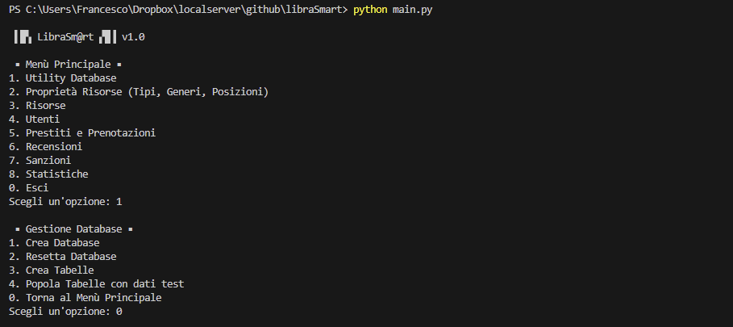

# ▌█▚ LibraSm@rt ▞█▐ v1.0 
## Applicativo per Gestione Biblioteca

**Autore:** Francesco di Biase  
**Matricola:** IN08000245

**Realizzato a completamento dell'E-tivity N.4 per l'esame "Basi di Dati" - Prof. D. Pasquini.**

## Descrizione
LibraSmart è un sistema avanzato per la gestione di una biblioteca, utilizzando Python insieme alle librerie MySQL-connector-python ed SQLAlchemy come ORM. È progettato per gestire in modo efficiente tutti gli aspetti delle principali operazioni bibliotecarie.

## Caratteristiche Principali
- **Gestione delle Risorse Bibliotecarie:** Libri, riviste, DVD, audiolibri, ecc.
- **Gestione dei Prestiti e delle Prenotazioni:** Per una corretta gestione delle risorse.
- **Gestione degli Utenti:** Inclusi i loro dati personali.
- **Operazioni CRUD:** Implementate per tutte le entità del sistema.
- **Gestione Errori:** Con messaggi esplicativi.
- **Statistiche e Classifiche:** Per il monitoraggio delle attività della biblioteca.
- **Ricerca Avanzata:** Per trovare rapidamente risorse e controllarne la disponibilità.
- **Integrità dei Dati:** Rigorosi vincoli per mantenere la coerenza delle informazioni.

## Interfaccia Utente
L'interfaccia utente si basa su una semplice interfaccia a riga di comando (CLI), con menù multi livello, per una facile interazione con le funzionalità offerte.



## Primo Avvio
- **Configurazione Database:** Impostare nel file `conf/db_config.py` i dettagli del database (HOST, PORT, USER, PASSWORD).
- **Gestione Database:** La voce "1.Gestione Database" del menu permette di accedere alle funzioni per la creazione del db con il nome di default (librasmart_db), la creazione delle tabelle e il popolamento con dati di esempio.
- **Reset Database:** Nello stesso sottomenù è presente una funzione per effettuare il reset del Database che consente un avvio pulito in caso di utilizzo con dati reali.
- **Funzioni Critiche:** Tutte le funzioni critiche per i dati richiedono il consenso dell'operatore per proseguire.

## Installazione dipendenze tramite `pip`
Esegui il seguente comando:

```
pip install -r requirements.txt
```

## Come Avviare
Esegui il seguente comando:

```
python main.py
```